# German Traffic Sign Recognition Project

## The project requires the following libraries/software:

- Python 3.5.2
- Matplotlib 2.0.0
- Tensorflow 1.0.0
- Keras 1.2.1
- Numpy 1.11.3
- OpenCV 3.1.0
- SciKit-Learn 0.18
- Jupyter Notebook 4.2.1

## The goals / steps of this project are the following:

- Load the data set (see below for links to the project data set)
- Explore, summarize and visualize the data set
- Design, train and test a model architecture
- Use the model to make predictions on new images
- Analyze the softmax probabilities of the new images
- Summarize the results into this written report

This project is graded against the [project rubric](https://review.udacity.com/#!/rubrics/481/view).

## Data Set Summary &amp; Exploration

### Data Set Summary Statistics

The code for this step is contained in the second code cell of the IPython notebook.

I used a combination of methods from **python** , **numpy** , and **matplotlib** to explore the data.

Here&#39;s a quick summary of the original dataset

- The size of original training set is **34799**
- The size of the augmented data set is **72701**
- The size of test set is **12630**
- The size of the validation set is **4410**
- The shape of a traffic sign image is **(width=32, height=32, depth=3)**
- The number of unique classes/labels in the data set is **43**

### Exploratory Visualizations

The code for this step is contained in the third code cell of the IPython notebook.

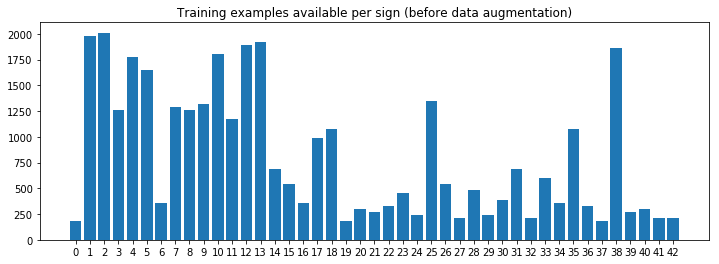

This is a chart showing the training examples available for each sign in the original data set. As you can see, not all signs have sufficient training data. I have written some code to add distortions to the original image to generate variants, so that they may be used as additional training data.

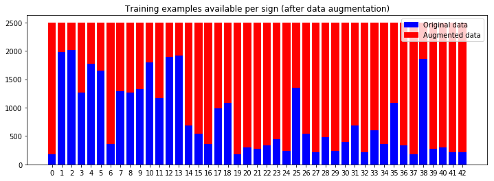

After augmenting the data, each of the traffic signs had 2500 training examples to work with.

## Model Architecture Design, Training and Testing

### Pre-processing of data

The code for this step is contained in the fourth and fifth code cells of the IPython notebook.

Each image in the data goes through 4 pre-processing steps:

1. First, the image is converted to greyscale using cv2.cvtColor, ending up with a shape of (32, 32). As per the 2011 paper on Traffic Sign classification by Sermanet and LeCun, converting the images to greyscale improves the accuracy of the model because we would be less succeptible to differences in lighting.

1. The second step is to apply histogram equalization to the image. As mentioned in this [OpenCV article](http://docs.opencv.org/3.1.0/d5/daf/tutorial_py_histogram_equalization.html), equalizing the histogram of an image has the effect of normalizing the intensity. The image won&#39;t be too bright or too dark, making learning more consistent. For this project, one of the biggest accuracy boosts I got was doing this.

1. Because machine learning prefers smaller numbers settled around a zero mean, the third pre-processing step was to normalize the values in the image between -1 and 1. After testing, I found that normalizing between -1 and 1 produced better results that normalizing between 0 and 1.

1. Finally, the image is reshaped. Another dimension is added so that the final image has a shape of **(32, 32, 1)**. The dimensions of the image need to be correct before we can feed it into our convolutional network.

Here is an example of a traffic sign image before and after **grayscaling** and **histogram equalization:**

| Original image | Greyscale with histogram equalization |
| :---: | :---: |
| 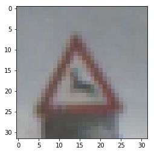 | 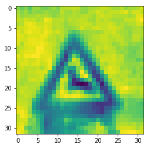 |

### Data preparation and augmentation

One key insight from exploring the dataset was that some traffic signs had a disproportionately high number of training examples, while others only had a few. To balance out the training examples, the data was augmented.

First, I assumed a target number of training examples per traffic sign (For this project, it was **2500 examples per sign** ). I then calculated the difference between the target and the existing counts, and generated that number of variants.

Image variants were generated using a random combination of the following operations:

- Random brightness
- Random scale
- Random perspective transform
- Random shift
- Random rotate
- Random blur

Here is an example of an original image and an augmented image:

| Original image | Image with distortions applied |
| --- | --- |
|  | 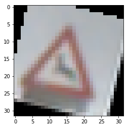 |

I have tried a few combinations of these distortions: Only one per image, applying all operations to every image, and a random mix of operations. So far, a random mix of distortion operations has produced the best results.

### Balancing the test and training sets

After the augmented data is generated, it is merged with the training set and the test set, and re-sampled and re-split using **sklearn.model\_selection.train\_test\_split()**. The following ratio is used:

- Training set 70%
- Test set 30%

### Model Architecture

The code for my final model is located in the sixth cell of the IPython notebook.

My final model consists of the following layers:

| **#** | **Layer** | **Description** |
| --- | --- | --- |
|   | Input | 32x32x1 normalized greyscale image |
| 1 | Convolution 5x5x12 | 1x1 stride, valid padding, outputs 28x28x12 |
| 2 | ReLU |   |
| 3 | Convolution 5x5x18 | 1x1 stride, valid padding, outputs 24x24x18 |
| 4 | Stage 1 max pooling | 2x2 stride, outputs 12x12x18 (fed directly to FC layer later) |
| 5 | Convolution 5x5x24 | 1x1 stride, valid padding, outputs 8x8x24 |
| 6 | Stage 2 max pooling | 2x2 stride, outputs 4x4x28 |
| 7 | Dropout | Keep probability 0.5 |
| 8 | Flatten and merge | Combining outputs from Stage 1 &amp; 2 pooling |
| 9 | Fully connected 1 | Input 2976, outputs 250 |
| 10 | ReLU |   |
| 11 | Fully connected 2 | Input 250, outputs 100 |
| 12 | ReLU |   |
| 13 | Fully connected 3 | Input 100, outputs 43 |
| 14 | L2 regularization |   |

### Model Training

I trained the model using a batch size of **64** , this number seemed to produce better results compared to 128 and 256. Also, rather than having a fixed epoch, I kept a countdown of the remaining epochs, and extended that countdown by a little bit every time we got a new accuracy high score. Most of the time, the learning seems to settle down at around 35 epochs.

For every epoch, the training set and the test set are mixed together and re-split **70:30** to help prevent overfitting a static training set.

### Solution Design

The code for calculating the accuracy of the model is located in the eigth cell of the IPython notebook.

**Structural design tuning**

- **Started with LeNet Lab architecture** as a baseline. Resulted in ~80++% accuracy against the test set.
- Tried **feeding both Stage 1 &amp; 2 pooling into Fully Connected Layer 1** , and augmented the data according to the 2011 Sermanet and LeCun paper. Results plummeted at the start. During training the evaluation accuracy would jump around wildly.
- Added **L2 Regularization** , stabilizing training progress and improving accuracy in general.
- **Switched to average pooling** for a while, the initial jumps in improvement were greater, but things ended up about the same at the end, or perhaps slightly worse. **Switched back to max pooling** after.
- To prevent overfitting, the original design had a dropout after the Stage 1 pooling layer. This may have been a bad decision. By dropping out too early the model seemed to lose the eye for details. **Shifting the dropout to AFTER the Stage 2 pooling layer** yielded improvements.
- Tried reducing the number of fully connected layers from 3 to 2. The performance deteriorated, so I left it at **3**.
- Noticed that the model had problems with fine details, like distinguishing between 20km/h and 30km/h. I **added another convolutional layer** in between the first and second one. Performance against the test and validation sets increased significantly.

**Parameter tuning**

- If the filter depth in the first convolution layer was low (e.g. 6), during training the accuracy would climb up quickly, but settle at a lower average accuracy.
- If the filter depth in the convolution layers were too high, the accuracy would climb slowly and settle at a low average accuracy as well.
- If the size of the filters were too small (less than 5), performance deteriorated also.
- Ended up going with 3 layers of 5x5 convolutions with increasing filter depth.
- In the fully connected layers, having too few neurons caused the accuracy to pick up faster during learning, but settle on a lower average accuracy. Going from 250 100 43 seemed to produce the best results.

### Final architecture choice

The paper showed promising results in traffic sign recognition because the fully connected layers could make inferences based on the combined information of the fine grain details of stage 1 pooling, and the more general/higher level information of stage 2 pooling. After testing that architecture out, and performing a lot of tuning, I managed to get good accuracy results.

### Final model results

- Training set accuracy of **99.3%**
- Validation set accuracy of **98.2%**
- Test set accuracy of **98.8%**

As the results are consistent across the training, test, and validation sets, it seems reasonable to conclude that the model has not overfitted any one specific set of data.

### Testing against images found on the web

Here are five German traffic signs that I found on the web:

| Image 1 | Image 2 | Image 3 | Image 4 | Image 5 |
| :-----: | :-----: | :-----: | :-----: | :-----: |
| 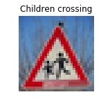 | 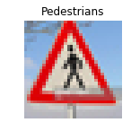 | 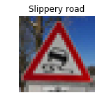 | 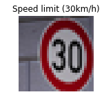 | 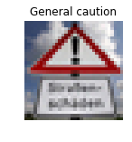 |

### Pre-test expectations

- The first and third images are similar to what the model has been training on, so I&#39;d expect it to recognize those.
- The second and fourth images have perspective shifts. The augmented data should help the model cover that, therefore I would expect it to recognize those as well.
- The last one is a combination of both sharp perspective, and significant additional content (a signboard at the bottom taking up almost half the image). I would expect the model to struggle with this one.

### Test results

The code for making predictions on my final model is located in the ninth cell of the Ipython notebook.

| **Image** | **Prediction** | **Outcome** |
| --- | --- | --- |
| Children crossing | Children crossing | Correct |
| Pedestrians | Pedestrians | Correct |
| Slippery road | Slippery road | Correct |
| 30 km/h | 30 km/h | Correct |
| General caution | Slippery road | Wrong |

### Post-test observations

The model correctly guessed **4 of the 5** traffic signs, which gives an accuracy of **80%** , which is similar to its performance on the training and validation sets. The last image was a tricky one. In hindsight, perhaps colour information should have been retained and used, or more intense perspective shifts should have been applied to the augmented data.

### Softmax Probabilities

The following table shows the test images and their corresponding top 5 predictions and softmax probabilities.

| Prediction Results |
| :----------------- |
| 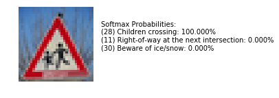 |
| 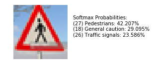 |
| 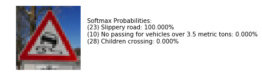 |
| 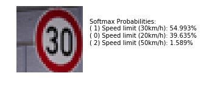 |
| 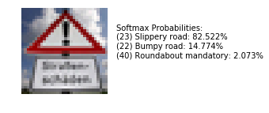 |

### Observations on softmax probabilities

While the first 4 images that were classified correctly, the model was not very confident on its classification of the second and fourth images. Also, for the last image, which the model failed to classify, the softmax probabilities show that it was **confidently wrong**. This indicates that further tuning is required. While it managed to get 4 out of 5 right, this may just have been a lucky fluke.
